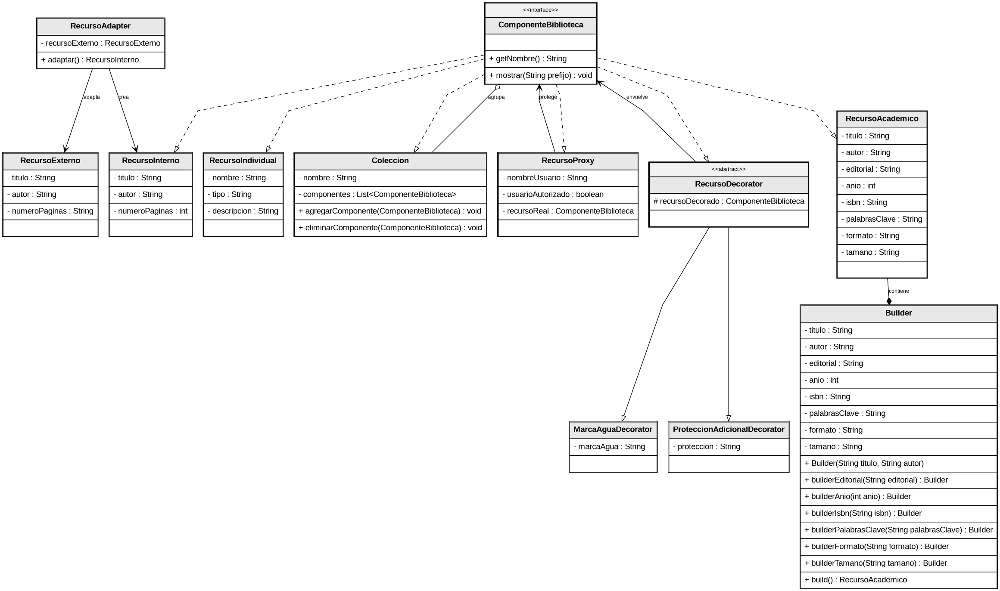

# SmartLibrary - Parcial Programación 2

## 1. Descripción del proyecto

Este proyecto representa una biblioteca digital llamada **SmartLibrary**.

Su propósito principal es demostrar cómo se pueden solucionar diferentes necesidades de un sistema usando **patrones de diseño** en Java.

Dentro del sistema se permite:

- Crear recursos académicos de una manera más organizada.
- Convertir recursos externos para que puedan ser usados dentro del sistema.
- Manejar colecciones y subcolecciones de recursos.
- Validar el acceso a recursos que tienen restricciones.
- Añadir características adicionales a un recurso sin modificar directamente su clase principal.

---

## 2. Pensamiento computacional

### 2.1 Abstracción

#### ¿Cuál es el problema que se debe resolver?

Se debe desarrollar un sistema orientado a objetos para una biblioteca digital llamada **SmartLibrary**, donde se apliquen patrones de diseño para construir recursos académicos, adaptar información externa, manejar permisos de acceso y organizar recursos dentro de colecciones.

#### ¿Qué datos son importantes para el sistema?

- Recursos académicos como libros, archivos digitales o documentos.
- Recursos externos que llegan con información en un formato diferente.
- Usuarios o validaciones relacionadas con permisos de acceso.
- Colecciones que pueden almacenar recursos individuales y también otras colecciones.
- Funciones adicionales que se pueden agregar a los recursos, como marca de agua o protección.
- Recursos académicos con varios atributos, algunos obligatorios y otros opcionales.

#### ¿Cómo se organiza la información importante?

- Módulo Builder: contiene `RecursoAcademico` y su Builder interno.
- Módulo Adapter: contiene `RecursoExterno`, `RecursoInterno` y `RecursoAdapter`.
- Módulo Proxy: contiene las clases relacionadas con la validación de acceso.
- Módulo Composite: contiene `ComponenteBiblioteca`, `RecursoIndividual` y `Coleccion`.
- Módulo Decorator: contiene las clases que permiten agregar funciones extras a los recursos.

#### ¿Qué funciones debe cumplir el sistema?

- F1: Crear recursos académicos de forma ordenada usando un Builder.
- F2: Transformar un recurso externo al formato usado por SmartLibrary.
- F3: Validar si un usuario puede acceder o no a un recurso.
- F4: Organizar recursos dentro de colecciones y subcolecciones.
- F5: Agregar comportamientos adicionales a un recurso sin alterar su clase original.
- F6: Probar desde el `Main` el funcionamiento de los recursos, colecciones, adaptadores, decoradores y accesos protegidos.

---

### 2.2 Descomposición

El proyecto se separa en diferentes módulos para que cada parte tenga una responsabilidad específica:

- Módulo Builder:
  Incluye la clase `RecursoAcademico` con su Builder interno. Su función es permitir la creación de recursos académicos de una forma más clara y flexible.

- Módulo Adapter:
  Incluye `RecursoExterno`, `RecursoInterno` y `RecursoAdapter`. Este módulo se encarga de convertir los datos de un recurso externo al formato que necesita el sistema.

- Módulo Proxy:
  Incluye las clases que revisan si un usuario tiene permiso para acceder a un recurso. Su función es permitir o bloquear el acceso según corresponda.

- Módulo Composite:
  Incluye `ComponenteBiblioteca`, `RecursoIndividual` y `Coleccion`. Este módulo permite manejar recursos individuales y grupos de recursos de una manera uniforme.

- Módulo Decorator:
  Incluye clases decoradoras que agregan características extras a un recurso. Por ejemplo, se puede agregar una marca de agua o una protección adicional sin cambiar la clase original.

- Módulo principal:
  La clase `Main.java` contiene la demostración general del proyecto y permite comprobar que los patrones funcionan correctamente.

---

## 3. Patrones de diseño utilizados

En el proyecto se implementan los siguientes patrones:

- Adapter
- Proxy
- Composite
- Decorator
- Builder

---

## 4. Principios SOLID aplicados

### S - Responsabilidad Única

Cada clase tiene una función específica dentro del sistema:

- `RecursoAdapter` se encarga únicamente de adaptar información.
- `RecursoProxy` se encarga de controlar el acceso.
- `Coleccion` administra los elementos que contiene.
- `RecursoAcademico.Builder` se encarga de construir objetos de tipo recurso académico.

### O - Abierto/Cerrado

El código permite agregar nuevas funcionalidades sin modificar demasiado las clases existentes:

- En Decorator se pueden crear nuevos decoradores para añadir comportamientos sin cambiar la clase base.
- En Composite se pueden agregar nuevos componentes mientras implementen la misma interfaz.

### L - Sustitución de Liskov

Las clases que implementan una misma interfaz pueden usarse de forma similar:

- Cualquier clase que implemente `ComponenteBiblioteca` puede agregarse dentro de una `Coleccion`.
- Un recurso simple, un recurso adaptado o un recurso decorado pueden mostrarse usando el mismo comportamiento general.

### I - Segregación de Interfaces

La interfaz `ComponenteBiblioteca` es sencilla y contiene solo los métodos necesarios.

Esto evita que las clases tengan que implementar métodos que no usan.

### D - Inversión de Dependencias

Algunas partes del sistema dependen de interfaces y no directamente de clases concretas:

- `Coleccion` trabaja con `ComponenteBiblioteca`, no con una clase específica.
- Proxy y Decorator también usan la interfaz, lo que ayuda a cambiar o agregar nuevas implementaciones con mayor facilidad.

---

## 5. Organización del proyecto

### `models/adapter`

Contiene las clases que permiten convertir recursos externos al formato interno de SmartLibrary.

### `models/proxy`

Contiene las clases encargadas de revisar el acceso antes de mostrar un recurso.

### `models/composite`

Contiene la interfaz común y las clases que permiten crear colecciones, subcolecciones y recursos individuales.

### `models/decorator`

Contiene las clases que agregan funcionalidades adicionales a los recursos, como marca de agua o protección.

### `models/builder`

Contiene la clase `RecursoAcademico` y su Builder interno para crear recursos académicos de forma más flexible.

---

## 6. Ejecución del proyecto

La clase [`Main.java`](src/main/java/uniquindio/edu/co/Main.java) realiza una prueba general de los patrones implementados y muestra los resultados en consola.

---

## 7. Diagrama de clases

El siguiente diagrama muestra de manera general las clases principales del sistema y sus relaciones:

